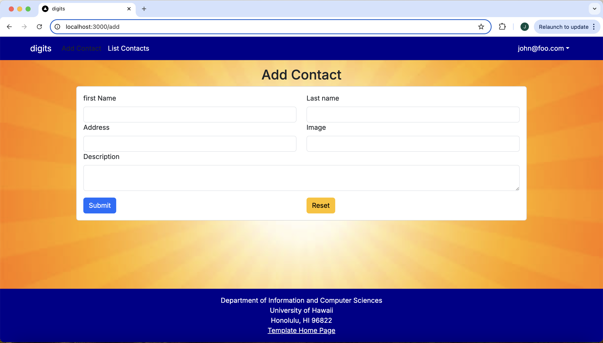

# Digits UI

<i>Digits is website that allows users to:</i>

- Register an account.
- Create and manage a set of contacts.
- Add a set of timestamped notes regarding their interactions with each contact.

## Set Up
<i>Assuming you have a Postgres account and log in already</i>

First, you will need to download a copy of "Digits". Since it is a private repository, you must gain access from the author.

Second, you will need to download npm with:

Third, open a terminal window in VSCode an run the command  createdb digits 

Fourth, copy the sample.env file to a new file called .env.

Fifth, edit the .env file to set the DATABASE_URL to postgresql://<username>:<password>@localhost:5432/digits?schema=public.

Sixth, migrate the database by running the command npx prisma migrate dev. This will create the tables in the digits database.

Seventh, seed the database by running the command npx prisma db seed. This will populate the tables with some sample data.

Eigth, start the website by using the command npm run dev

If it all goes correctly your Ferminal should say something like below:

You can view the website at https://localhost:3000. You are able to register with a new account or log in just use one of the credentials in the settings.development.json file.

## User Interface Walkthrough
### Landing Page
Going on the website for the first time, the landing page will provide some insight as to the capabilities of what Digits can do:

&nbsp;

### Register
Assuming you wanted to create your own account, you would click on the Login button at the top right where you would then select Sign up to create a new account.

&nbsp;

### Sign In
To sign in you would click on the Login button at the top right where you would then select Sign in where you would then put in your information. (As mentioned previously, you may also just use one of the credentials in the settings.development.json file.)

&nbsp;

### User Home Page
After you have logged in, the system will take you to the homepage which looks very similar to the landing page. However, the NavBar contains links to "Add Contact" and "List Contacts".

&nbsp;

### Add Contacts
Clicking on "Add Contacts" allows for the user to create a new contact to put into the database and associate it with their user.

&nbsp;

### List Contacts
Clicking on the "List Contacts" will list all of the contacts which are associated with the user.

#### Timestamped Note
As you can see there is also a section where you can add a note to the contact where you could write things such as last time you saw them or things to remember them by. I just put some random examples as you can see in the image where it has the date I wrote it and just some random phrases I put in as an example.

 
&nbsp;

### Edit Contacts
If you notice in the previous picture there is a blue Edit button in the bottom left hand corner of the individual contacts. When you click that it brings you to the page below where you can see it has the information already put in but allows you to change it.

&nbsp;

### Admin Mode
If you were to sign into Admin you will be given another option within your NavBar called "Admin" (login can be found in the setting file). You will get access to all Contacts associated with all of the users as well as the user in which it belongs to underneath the bio of each contact.

